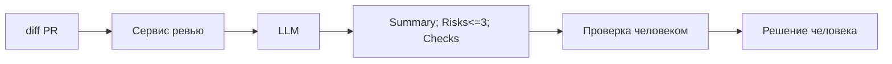

# ADR: решение для первого рабочего сценария

Файл ведёт OpenCode. Обсудите с агентом содержание и проверьте предложенный diff. Все дополнения и исправления поручайте агенту в чате.

- Статус: proposed
- Дата: 2026-10-08
- Ответственные: студент, OpenCode

## Контекст

Учебный кейс: AI‑помощник ревьюера PR. Вход — один diff. Решение принимает человек. По согласованным правилам AI получает только diff и Context Pack/Master Prompt и возвращает структурированный результат.

## Решение

Используем AI‑помощника как отдельный этап анализа diff перед решением человека.

Поток: diff → сервис ревью → LLM → структурированный результат → проверка человеком.

Правила решения:
- AI получает только diff и согласованный Context Pack / Master Prompt.
- Возвращает Summary, максимум 3 Risks с evidence (цитаты из diff) и Checks.
- Финальное решение принимает человек.
- AI не меняет код и не делает approve/merge.

## Рассмотренные альтернативы

| Альтернатива | Почему не выбрали сейчас |
|---|---|
| Полностью ручное ревью без AI | Дольше и менее структурировано; первичный результат не стандартизирован |
| Автоматическое принятие решения AI без человека | Нарушает требование: решение принимает человек; риск ошибок и домыслов |

## Последствия и главный риск

- Положительные последствия: более быстрый и структурированный первичный анализ diff; проверяемые риски и шаги.
- Ограничения: вход только diff; не более 3 рисков; без внешних источников; AI не меняет код и не approve/merge.
- Главный риск: AI может выдать недоказанное замечание или придумать требование, которого нет во входных данных.
- Как проверим риск: проверять каждый риск по diff и отмечать неподтверждённые пункты; сравнивать результаты P1-01 и P1-02.

## Архитектурная схема

## Как использовали AI

- Для чего: зафиксировать архитектурное решение учебного кейса.
- Тип промпта: структурирование на основе согласованного контекста, Master Prompt и результатов P1-01/P1-02.
- Строка в [`prompts.md`](prompts.md): Master Prompt v1; записи P1-01 и P1-02.
- Что проверил студент и какие исправления поручил агенту: подтвердил отсутствие неподтверждённых сервисов/интеграций; уточнил схему и ограничения.
