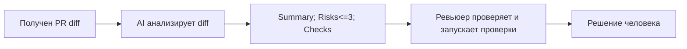

# Анализ процесса: AS IS и TO BE

Файл ведёт OpenCode. Обсудите с агентом содержание и проверьте предложенный diff. Все дополнения и исправления поручайте агенту в чате.

## AS IS

Разработчик или ревьюер получает diff PR, вручную просматривает изменения, формулирует замечания, ищет риски и решает, какие проверки нужны. Основные проблемы: уходит время; часть замечаний может быть слишком общей или без конкретных доказательств по строкам diff.

## TO BE

Тот же процесс с AI‑помощником: AI получает diff, возвращает краткое Summary, не больше 3 рисков с доказательствами (ссылка на файл/строку и цитата из diff) и список проверок. Человек проверяет результат, при необходимости запускает проверки и принимает решение.

## Разница

| Что меняется | AS IS | TO BE | Как проверим изменение |
|---|---|---|---|
| Источник первичного анализа | Только человек читает diff | AI формирует первичный результат по diff | Сопоставление P1-01 vs P1-02 |
| Формат замечаний | Возможны общие формулировки | Каждый риск со ссылкой и цитатой | Просмотр результатов |
| Количество рисков | Не регламентировано | Не более 3 | Проверка формата ответа |
| Подтверждение доказательствами | Не всегда | Требуется цитата из diff | Наличие цитат в Risks |
| Проверки | Не всегда с шагами | Список воспроизводимых шагов | Наличие раздела Checks |

## Как использовали AI

- Для чего: описать процесс AS IS и TO BE по учебному кейсу.
- Тип промпта: структурирование на основе согласованных context.md и Master Prompt в prompts.md.
- Строка в [`prompts.md`](prompts.md): раздел «Master Prompt v1».
- Что проверил студент и какие исправления поручил агенту: подтвердил, что описаны только согласованные элементы процесса, без неподтверждённых систем и требований.
