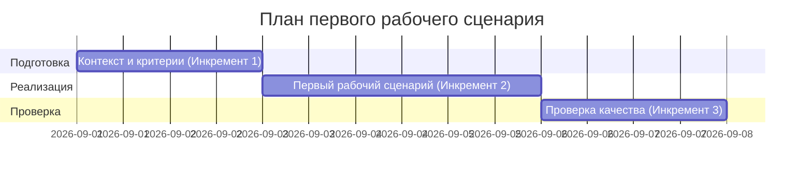

# План поставки

Файл ведёт OpenCode. Обсудите с агентом содержание и проверьте предложенный diff. Все дополнения и исправления поручайте агенту в чате.

## Инкременты и ответственность

| Инкремент | Наблюдаемый результат | Что делает человек | Что делает AI или субагент | Проверка | Зависимости |
|---|---|---|---|---|---|
| 1 | Согласованные правила ревью, Context Pack и Master Prompt | Утверждает правила, проверяет соответствие контенту README | Структурирует Context Pack и Master Prompt на основе согласованного контекста | Просмотр prompts.md (Master Prompt v1) и context.md | Нет |
| 2 | Получен результат по первому сценарию: Summary, <=3 Risks с доказательствами и Checks | Передаёт diff AI, проверяет результат и принимает решение | Анализирует diff и возвращает Summary, Risks (<=3) с evidence и Checks | Наличие разделов в results/P1-02.txt, соответствие формату | Инкремент 1 |
| 3 | Зафиксированы итоговые проверки и границы действий AI | Сравнивает P1-01 vs P1-02, оценивает соблюдение границ | Не выполняет действий; результат P1-02 используется для сравнения | Раздел «Сравнение двух запусков» и обновлённый Master Prompt | Инкременты 1–2 |

## Диаграмма Ганта

## Как использовали AI

- Для чего: сформировать план из 3 инкрементов по учебному кейсу.
- Тип промпта: структурирование на основе согласованного контекста и Master Prompt.
- Строка в [`prompts.md`](prompts.md): Master Prompt v1, P1-01/P1-02.
- Что проверил студент и какие исправления поручил агенту: проверил соответствие задач плану (без новых требований), уточнил названия и проверки.
